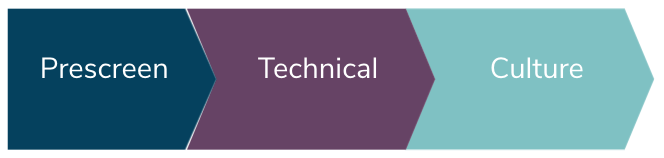

# Techops interview process



We know 0% about this person. We want to know as close to 100% as possible.

#### THE PRESCREEN
- We aren't trying to determine fit right away with these questions. We are attempting to filter out individuals who don’t have enough experience, or who are [fraudulent candidates](https://www.reddit.com/r/WatchPeopleDieInside/comments/dhasf4/recruiter_catches_candidate_cheating_during_skype/).
- [Prescreen Questions found here.](docs/00-prescreen-questions.md)
- Take notes and provide a summary of the call. What were their answers to the questions? 
- Let the candidate know upfront to expect that a portion of the technical round will be hands on, and they should expect to SSH into a remote server to complete a live-troubleshooting-module

#### THE TECHNICAL ROUND
- Give the candidate a realistic job preview (heres a broken service. Fix it.)
- Does this candidate have the necessary skills needed to do the job? Can the candidate troubleshoot on the fly under pressure (time limit) (inteview)
- We want to figure out the candidates technical abilities (entry, junior, senior, etc).
- We want to validate their resume and verify that they are making factual claims about their experience.
- The technical round lasts two hours and is broken up into two parts. The 1st hour the candidate sits down with the module and tries to complete it. In the 2nd hour we come back in the meeting, review the module, talk about the role, ask the candidate questions, and answer any questions the candidate might have.

#### THE CULTURE FIT
- Does the candidate live up to the company values?
- What drives this candidate, what motivates them? 
- *(bonus)* Any potential concerns raised during the technical round. We can drill into them again.


---

## Technical Round Setup Instructions

*(This process takes about 15 minutes to deploy/install services.)*

### 1. Deploy the interview environment

```
cd terraform/
terraform init
terraform apply
```

### 2. Deploy the live-troubleshooting module 

```
gcloud container clusters get-credentials interview-cluster --zone northamerica-northeast1-a --project techops-interview
cd live-troubleshooting-modules/broken-rails-app
kustomize build . | kubectl apply -f-
```

### 3. Email Instructions for the candidate
[Email-Template can be found here](https://bitbucket.org/trc/techops-interview/src/master/docs/01-live-troubleshooting-module-email-template.md) 

- 15 minutes before the interview begins. **EMAIL** the candidate the instructions.
- Replace Variable $CANDIDATE_NAME
- Replace Variable $IPADDRESS of the bastion host
- Attach SSH key provided in /ssh folder 


### 4. The Interview
- At the beginning of the first hour, hop into the meeting and introduce yourself, say hello, and confirm the candidate got the email. Answer any questions the candidate might have. Let them know you will be back in an hour.  
- After an hour, hop back on the meeting call. Review the module with the candidate, ask what they would have done given more time.
- From here you can transition back to a normal technical interview. Talk about the role, what you are looking for,  and ask the candidate questions.
- Reserve the last 10~ minutes for any questions the candidate may have, and thank them for their time.
   

### live-troubleshooting-modules overview
[See the ./live-troubleshooting-modules/README.md for more information.](https://bitbucket.org/trc/techops-interview/src/master/live-troubleshooting-modules/)
